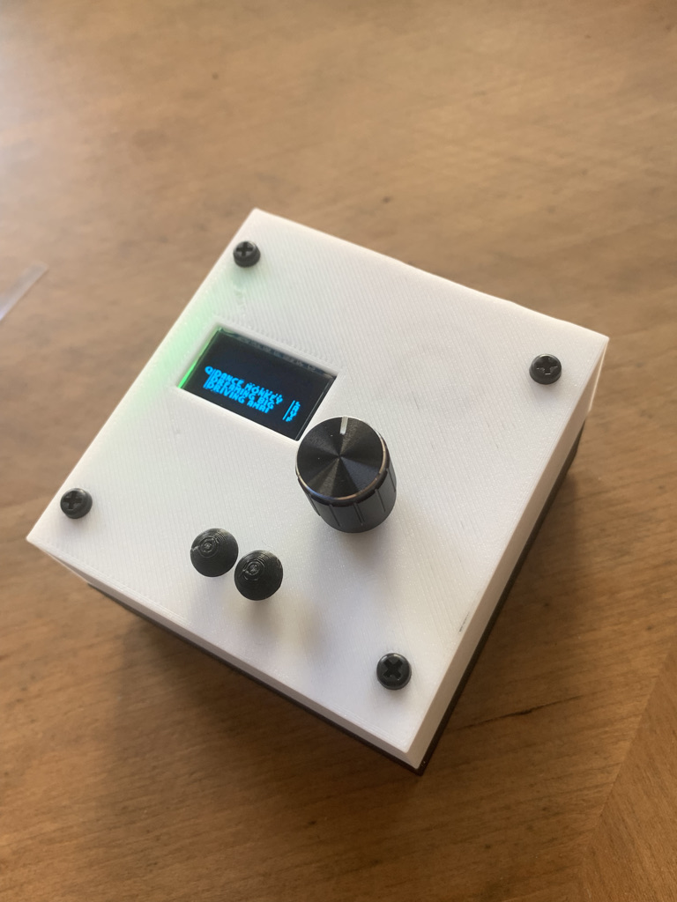
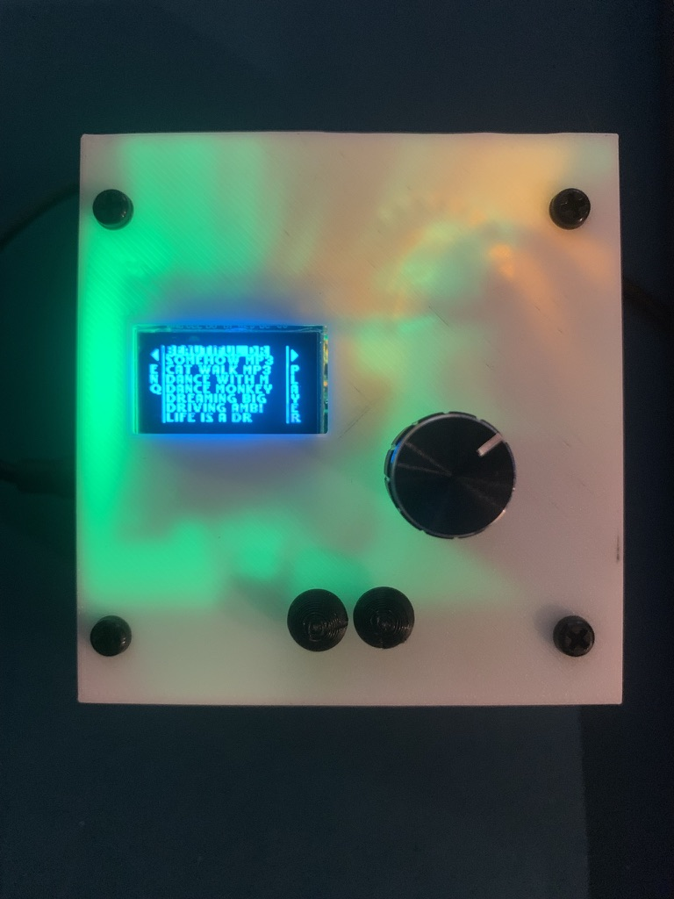
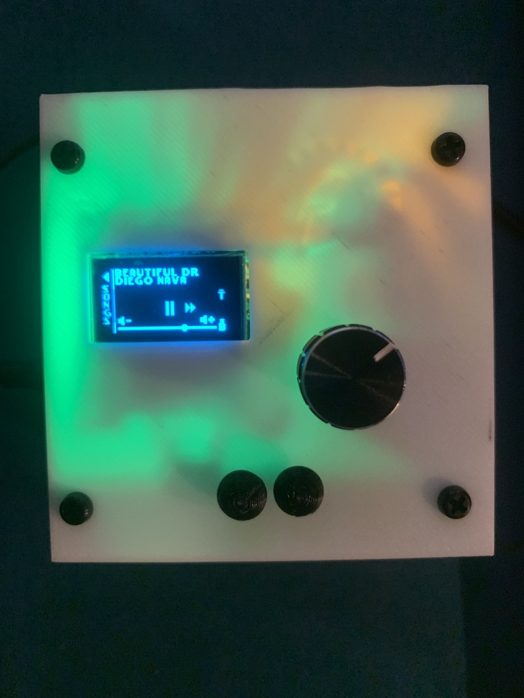

## Pictures
#### MP3 Enclosure

#### MP3 Song List Screen

#### MP3 Player Screen

#### MP3 Disassembly

#### MP3 CPU Utilizaation


## Project Documentation

This is the documentation of everything relevant to this folder, which does quite a few things:

* Run unit-tests based on C Unity Framework
* Generate code from the DBC file
* If all goes well above, then compile sources for the ARM processor


----

## Unit Tests

The unit-tests operate as follows:

* Sources from the `test` folders are obtained, and are compiled
  * Note that sources inside of `test` is not compiled for the ARM processor
* Each `test_<filename>.c` is compiled to a separate executable
  * Mocks are generated based on the `#include`'d files
  * The `test_<filename>.c` is like a "makefile", all includes are built, and mock includes are mocked
  * Note that unit tests run on your host machine (windows, linux, mac), so it needs a compiler for your machine
  * Windows compiler (MinGW) is checked into this repo, but we rely on Mac and Linux having existing compilers pre-installed. Ubuntu will always have it installed by default and for Mac you can install the GCC compiler yourslef (`brew install gcc`)
* If there is a header file you wish to replace entirely, then put them inside `unittest_header_overrides` folder
  * The unit-test framework will look at this folder first before it searches anywhere else
  * We have made a few FreeRTOS overrides because FreeRTOS source uses macro-like functions that are not "mockable", and we simplify its API at the overrides folder such that we can generate mocks.

Good references for unit-tests:

* Test `static` methods of a source file
  * Simply `#include` the `*.c` file rather than `*.h` file
  * Check `test_periodic_scheduler.c` file (Hit Ctrl+P in VS Code to find this file)

Much more elaborate Unit-Tests how-tos are [documented here](https://gitlab.com/sibros_public/public/-/wikis/c/unit_tests).


----

## DBC code generation

DBC file is the documentation of the bits and bytes on the CAN bus (SJSU class CmpE243). Have a [look at the DBCs for various production cars here](https://github.com/commaai/opendbc). Users can define their communication protocol in a DBC file, and C code is generated from this file that can be used to send and receive data on the CAN bus.

Here is the process when you run the `scons` command on this folder:

* `*.dbc` file is located in the `lpc_*` project
  * This means that you can rename `project.dbc` to anything, such as `cmpe243.dbc`
* Custom code generater is used that is built on top of [CAN Tools](https://cantools.readthedocs.io/en/latest/) (open source software)
* Code is generated at your respective build directory, such as `_build_lpc40xx_freertos/auto_generated` folder

Whichever file (such as `main.c`) needs the generated code API, simply `#include "project.h"` and then you should be able to use the generated code.

An important aspect of code generation is that you should not have an API that is not relevant for your CAN node. So if you are the `DRIVER` CAN node, then you should not have functions that are related to sending sensor values of the `SENSOR` CAN node. To generate code for a specific CAN node, you can use the `--dbc-node-name=<NODE NAME>` syntax.

* scons `--dbc-node-name=<node name>`
* Example: `scons --dbc-node-name=MOTOR`
* Example: `scons --dbc-node-name=MOTOR -j4 --project=lpc40xx_freertos`
* This ensures that you will not generate any code that is not relevant for your CAN node
* The default behavior is that code is generated for "ALL" nodes, which is not something you should do. This "ALL" type should be used for purely test purposes only. Another positive side effect is that when the DBC gets bigger, you want to read the code that is only relevant for yourself.


----

## Floating point

`float` is an IEEE single precision 32-bit floating point number. The Cortex-M4 has hardware support for this data type, and math operations involving this data type will be very fast.

Example of `float f = random() * 1.1;`
```c
    16ac:	ed9f 7a30 	vldr	s14, [pc, #192]	;
    16b0:	eddd 7a03 	vldr	s15, [sp, #12]
    16b4:	482f      	ldr	r0, [pc, #188]	;
    16b6:	ee67 7a87 	vmul.f32	s15, s15, s14
```

`double` is a 64-bit float, and there is no hardware support for this. This means that math operations performed using this data type will be VERY slow.

Same example with double that uses software routine `__aeabi_dmul()` to multiply:
```
    16ce:	e9dd 0104 	ldrd	r0, r1, [sp, #16]
    16d2:	a321      	add	r3, pc, #132	;
    16d4:	e9d3 2300 	ldrd	r2, r3, [r3]
    16d8:	f002 ff60 	bl	459c <__aeabi_dmul>
    16dc:	e9cd 0104 	strd	r0, r1, [sp, #16]
```


----

## Folder Structure

The folder structure proposed below not only organizes the source code, but also promotes good practices indicating which code should invoke (or not invoke) code at other folders.

The folder structure takes inspiration from code development at Lockheed Martin. Then, it was tried and tested further and many controllers at Tesla use similar directory structure as the one proposed below.

- L0 - Low level
- L1 - FreeRTOS
- L2 - Standalone utilities
- L3 - Drivers
- L4 - I/O
- L5 - Application

The function invocations shall go from a layer **downwards**, but never upwards; so `L2 Standalone utilities` should never make a function call into the `L3 - drivers` or the Application functions.

### `l0_low_level`

Normally, you will not modify anything at this folder.

`l0_low_level` is responsible to do the following:

- Initialize RAM
- Initialize the clock system
- Jump to `main()`

### `l1_rtos`

Do not modify anything at this is the folder; it is for FreeRTOS source code only.

### `l2_utils`

Typical sources here that can be compiled **without** any other dependency on a library other than standard C library.

This folder contains utility libraries, such as `buffer.h` that the drivers or above layers can utilize. Include code here that does not depend on a lot of other code modules. **Ensure that the code that goes here does not make function calls to higher layers**.

Another common use case is for instance a driver utilizing a buffer from this folder, or an `l4_io` utilizing an `sl_string` from the code modules at this folder.

### `l3_drivers`

We can state the obvious here: All drivers should be placed at this directory and it is allowed to use the RTOS and standalone utilities.

### `l4_io`

This is for sources that perform input-output, such as a CLI handler. You should not put tasks' code here, but rather helper code for the `l5`

### `l5_application`

This is mainly for task level code.
